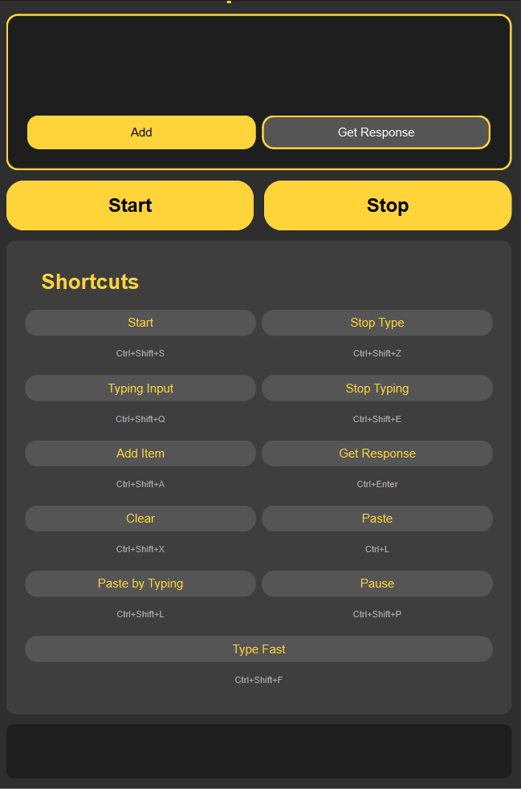

# 60Pass 🧠⚡  
> A keyboard-first productivity tool to collect multiple inputs and ask AI for help seamlessly.

---

## 📌 What is 60Pass?

**60Pass** is a lightweight utility designed to help users:
- Copy and store **multiple pieces of text**
- Control workflows using **keyboard shortcuts**
- Send accumulated inputs to an **AI assistant**
- Stay focused without switching contexts

It is built for **speed**, **muscle memory**, and **minimal UI friction**.

---

## 🎨 UI Overview

The interface is intentionally minimal and action-oriented:

- **Input Area**  
  A large focused container where collected text lives.

- **Primary Actions**
  - **Add** – Append copied content to the buffer
  - **Get Response** – Send collected inputs to AI
  - **Start / Stop** – Control listening or typing states

- **Keyboard-first Design**  
  Every major action is mapped to a shortcut to avoid mouse usage.

---

## ⌨️ Keyboard Shortcuts

| Action | Shortcut |
|------|---------|
| Start | `Ctrl + Shift + S` |
| Stop Type | `Ctrl + Shift + Z` |
| Typing Input | `Ctrl + Shift + Q` |
| Stop Typing | `Ctrl + Shift + E` |
| Add Item | `Ctrl + Shift + A` |
| Get Response | `Ctrl + Enter` |
| Clear | `Ctrl + Shift + X` |
| Paste | `Ctrl + L` |
| Paste by Typing | `Ctrl + Shift + L` |
| Pause | `Ctrl + Shift + P` |
| Type Fast | `Ctrl + Shift + F` |

---

## 🧠 How It Works (Conceptually)

1. User copies text from anywhere
2. Uses **Add** (or shortcut) to store it
3. Repeats for multiple snippets
4. Presses **Get Response**
5. AI receives **all context at once**
6. Response is returned or typed automatically

This avoids:
- Context loss
- Constant tab switching
- Repetitive prompting

---

## 🎯 Design Philosophy

- **Keyboard > Mouse**
- **Single-purpose UI**
- **Low cognitive load**
- **Fast iteration**
- **Human-in-the-loop AI**

The tool behaves like an **extension of thought**, not another app to manage.

---

## 🛠️ Use Cases

- Prompt engineering
- Research aggregation
- Coding assistance
- Writing drafts
- Studying / note compilation
- Repetitive form filling with AI help

---

## 🚀 Future Ideas

- History timeline of sessions
- Prompt templates
- Multiple AI backends
- Local-first AI integration
- Export collected inputs
- Plugin-based actions

---

## 📜 Status

Experimental / personal productivity tool.

---

**Author:** Chishti  
*When I do not know something, I learn while building the solution to it.*
